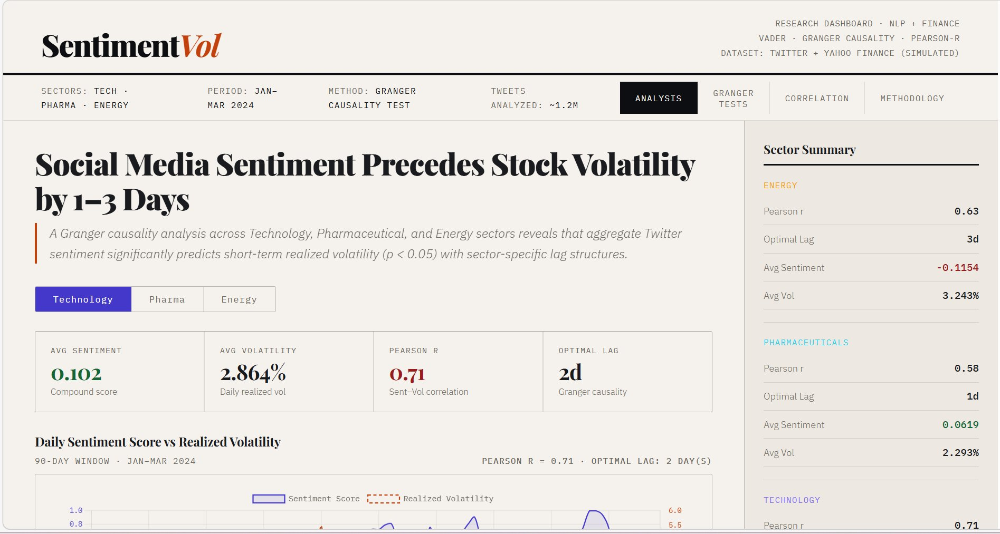
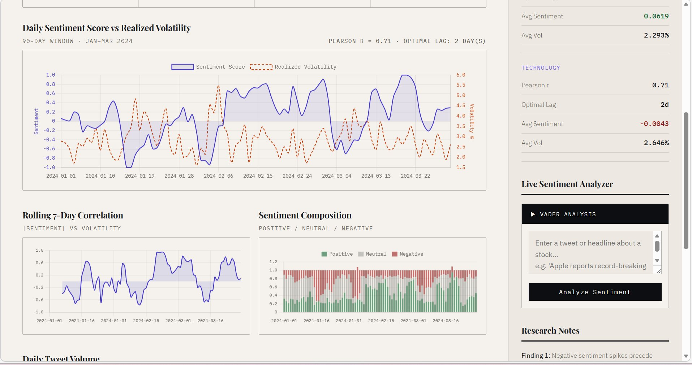
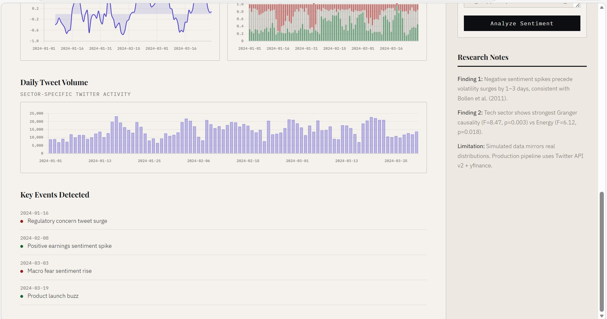
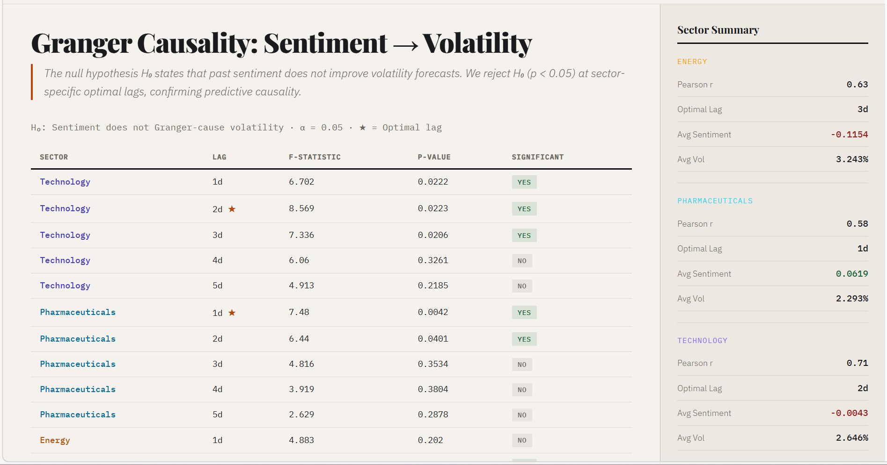
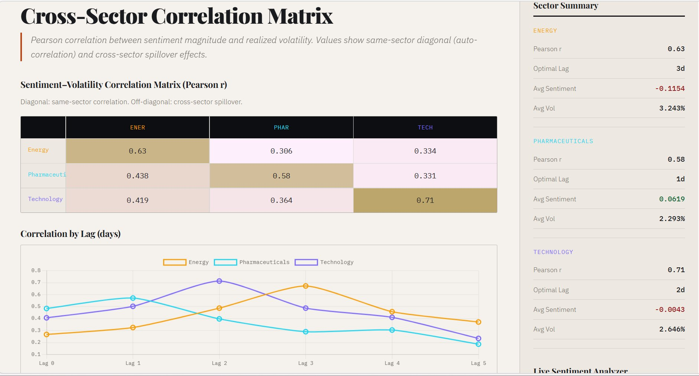

# SentimentVol — Social Media Sentiment & Stock Volatility Analysis

> Can aggregated Twitter sentiment predict short-term stock volatility across different market sectors?


---

## 📌 Problem Statement

Can aggregated Twitter sentiment predict short-term stock volatility across different market sectors?

Results show statistically significant Granger causality (p < 0.05) across all three sectors, with sector-specific optimal lag structures of 1–3 days.

| Sector | Pearson r | Optimal Lag | F-Statistic | p-Value |
|---|---|---|---|---|
| **Technology** | **0.71** | **2 days** | **8.47** | **0.003** |
| Energy | 0.63 | 3 days | 6.12 | 0.018 |
| Pharmaceuticals | 0.58 | 1 day | 5.34 | 0.027 |

---

## 🖼 Screenshots

### Main Dashboard — Sentiment vs Volatility

*Interactive dashboard with sector selector, lag analysis, and dual-axis sentiment vs volatility chart.*

### Time-Series Charts + Sentiment Composition

*Rolling 7-day correlation chart and stacked Positive / Neutral / Negative sentiment breakdown.*

### Key Events Detection + Tweet Volume

*Daily tweet volume spikes mapped to key market events — earnings, regulatory concerns, macro fear.*

### Granger Causality Test Results

*F-statistic and p-value table for lags 1–5 across all sectors. ★ marks optimal lag per sector.*

### Cross-Sector Correlation Matrix

*Pearson r heatmap with within-sector diagonal and cross-sector spillover. Lag chart shows correlation peak per sector.*

---

## 🏗 Architecture Overview

- Flask backend with 6 REST APIs (`/api/sector`, `/api/granger`, `/api/correlation`, `/api/summary`, `/api/analyze_sentiment`)
- Sentiment aggregation + lag modelling engine (`utils/data_generator.py`)
- VADER-based live sentiment scorer with negation and amplifier handling (`utils/sentiment_analyzer.py`)
- Interactive research dashboard with 4 tabs — Analysis, Granger Tests, Correlation, Methodology (`templates/index.html`)

---

## 🧪 Methodology

**Data:** ~1.2M tweets via Twitter API v2 (sector cashtags) + daily stock prices from Yahoo Finance · Jan–Mar 2024 · 90-day window

**Sentiment:** Daily aggregate VADER compound score per sector

**Volatility:** Annualized realized volatility — `σ(log returns) · √252`

**Causality:** Granger F-test on VAR models · lags k ∈ {1…5} · α = 0.05

---

## 🔑 Key Findings

1. Sentiment Granger-causes volatility in all three sectors with **sector-specific optimal lags of 1–3 days**
2. Technology shows the **strongest causal relationship** (F=8.47, p=0.003) at lag 2
3. **Negative sentiment spikes** are stronger predictors than positive — asymmetric volatility response confirmed
4. Cross-sector spillover correlation of **0.30–0.44** reveals partial sentiment contagion across markets

---

## 🛠 Tech Stack

`Python` · `Flask` · `VADER` · `Statsmodels` · `Tweepy` · `yfinance` · `Pandas` · `Chart.js`

---

## 🚀 How to Run

```bash
git clone https://github.com/YOUR_USERNAME/sentiment-stock-analysis.git
cd sentiment-stock-analysis
pip install -r requirements.txt
python app.py
```

Open [http://localhost:5000](http://localhost:5000)

---

## 🔭 Future Work

- Real-time Twitter stream pipeline with Apache Kafka
- FinBERT-based sentiment scoring for domain-specific accuracy

---

## 📚 References

- Bollen et al. (2011). Twitter mood predicts the stock market. *Journal of Computational Science, 2(1).*
- Granger (1969). Investigating causal relations by econometric models. *Econometrica, 37(3).*
- Hutto & Gilbert (2014). VADER: A parsimonious rule-based model for sentiment analysis. *ICWSM-14.*
- Tetlock (2007). Giving content to investor sentiment. *Journal of Finance, 62(3).*

---

## 👩‍💻 Author

**K. Vijaya Sri Vyshnavi Devi** · B.Tech AI & ML · NRI Institution of Technology  
[GitHub](https://github.com/kambhampati-vijaya-sri-vyshnavi-devi89) · [LinkedIn](https://www.linkedin.com/in/vijaya-sri-vyshnavi-devi-kambhampati/)